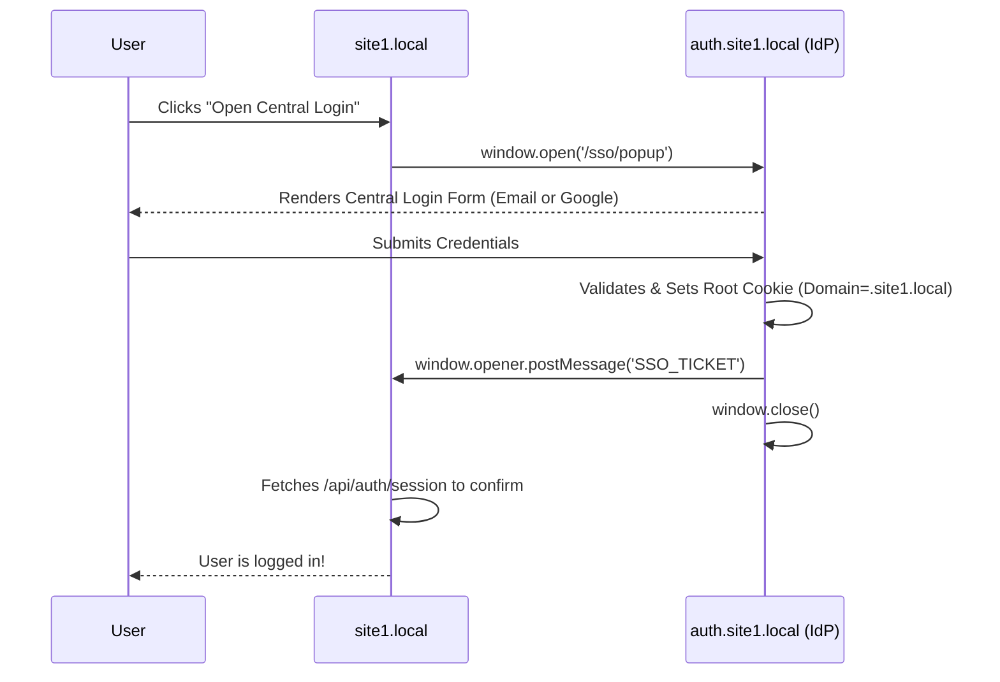
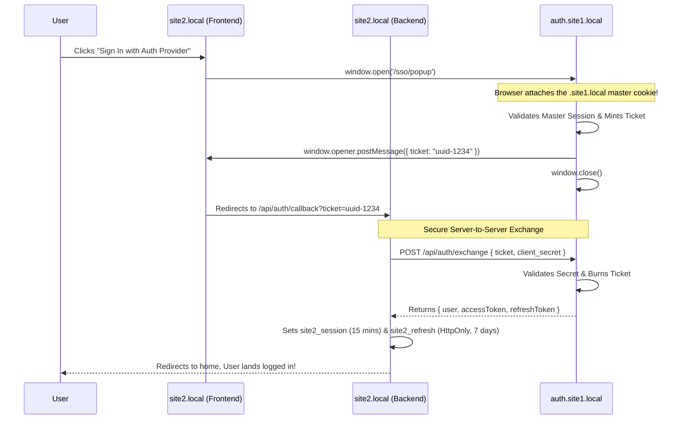
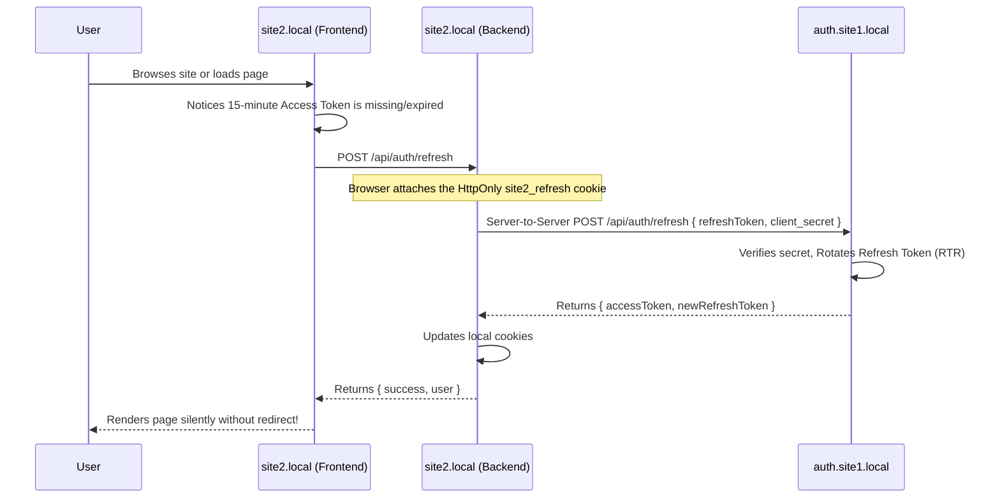

# Multi-Domain Authentication Architecture (Final)

This document outlines the final production-ready architecture for sharing authentication state across 16+ domains and subdomains using a centralized Identity Provider (IdP) model with Refresh Token Rotation.

## 1. Centralized Login & Subdomain Sharing (The `.site1.local` boundary)

To avoid duplicating login forms across 16 sites, no consumer application builds its own UI. Instead, all consumer sites launch the central Auth Provider's popup or hosted login page.

When applications share the same registrable domain (e.g., `site1.local` and `account.site1.local`), they instantly share authentication state via a Root Domain Cookie (`Domain=.site1.local`).

### Flow Diagram

## 2. Cross-Domain SSO & Token Exchange (The `site2.local` boundary)

Modern browsers enforce strict partitions on cross-site cookies. A cookie set for `.site1.local` cannot be read by `site2.local`. To recover a session seamlessly, we use an SSO Ticket Exchange paired with **Confidential Client Secrets** and **Refresh Tokens**.

## 3. Silent Background Renewal (Refresh Token Rotation)

Because third-party cookies (and hidden iframes) are blocked by modern browsers (Safari ITP), consumer sites enforce a short-lived local session and silently renew it server-to-server.

## Security Best Practices Implemented

1. **No Frontend AWS SDKs:** Consumer sites do not import heavy OAuth or AWS Amplify SDKs. All Cognito interactions are abstracted strictly to the `auth.site1.local` backend.
2. **Confidential Clients:** Cross-domain exchanges require a backend `client_secret`, preventing intercepted tickets or tokens from being maliciously used.
3. **HttpOnly Refresh Tokens:** Long-lived 7-day tokens are strictly `HttpOnly`, mathematically preventing XSS theft.
4. **Refresh Token Rotation (RTR):** Every time a refresh token is used, it is burned and a new one is issued. If a token is stolen and used simultaneously, the IdP detects the reuse and revokes all access globally.
