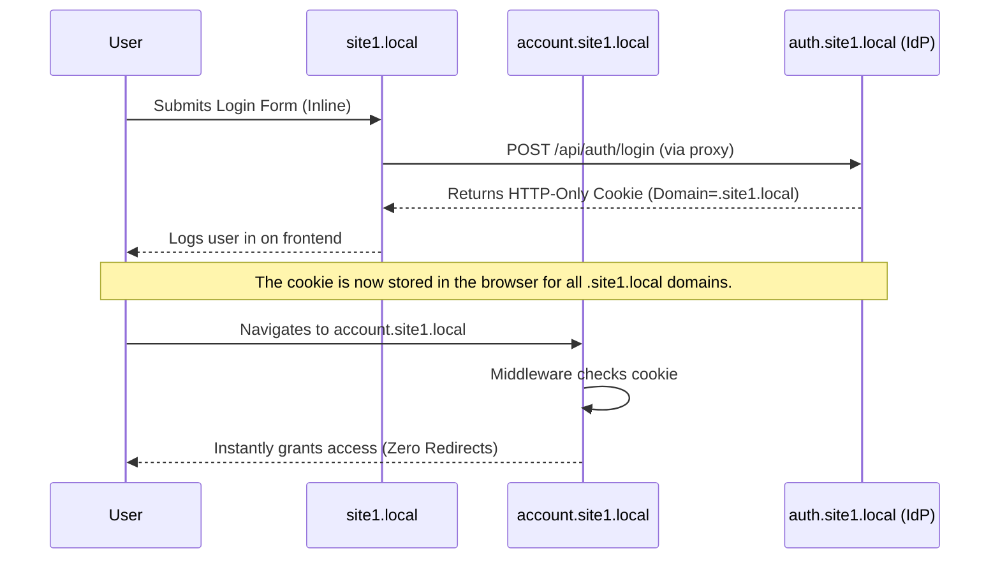
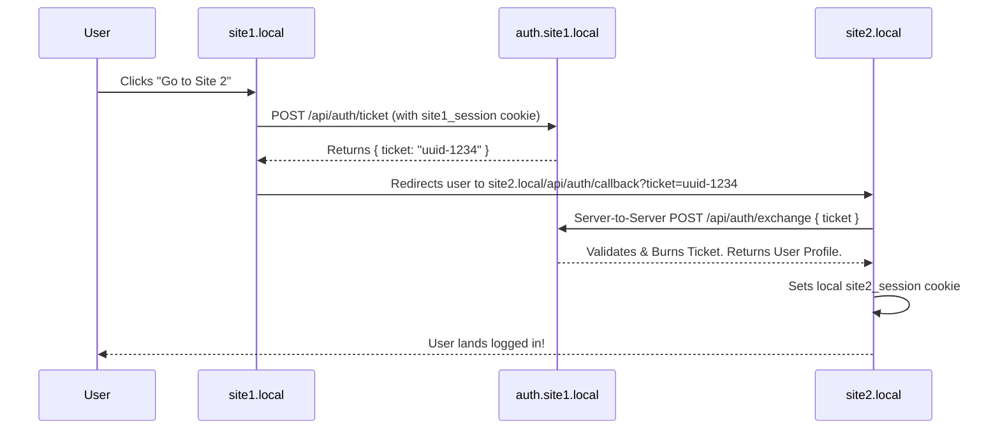
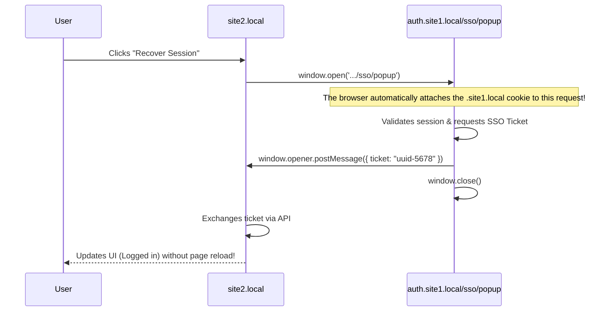

# Multi-Domain Authentication Architecture

This document outlines the architecture and flow for sharing authentication state across multiple domains and subdomains without relying on forced full-page redirects on public-facing sites.

## 1. Subdomain Cookie Sharing (The `.site1.local` boundary)

When applications share the same registrable domain (eTLD+1), they can seamlessly share authentication state using a Root Domain Cookie. 

In our architecture, `site1.local`, `account.site1.local`, and `auth.site1.local` all share the `.site1.local` domain.

### Flow Diagram

## 2. Cross-Domain Session Recovery (The `site2.local` boundary)

Modern browsers enforce strict partitions on cookies. A cookie set for `.site1.local` cannot be read by `site2.local`. To recover a session on a completely different domain without a full-page redirect, we use a single-use SSO Ticket Exchange system.

We implemented two primary patterns for this:

### Pattern A: Link-Based Seamless Hop
When a user navigates from `site1` to `site2` via a link, we can pre-emptively attach a secure ticket.

### Pattern B: Silent SSO Popup Handshake
If a user navigates directly to `site2.local` (e.g., via a bookmark), they won't have a ticket in the URL. We use a brief, silent popup to bridge the cross-domain gap securely.

## Security Considerations

1. **Short-Lived Tickets**: SSO tickets must expire quickly (e.g., 60 seconds) to prevent interception and reuse.
2. **Burn on Read**: The IdP must delete the ticket from its store the exact moment it is exchanged.
3. **HTTPS is Mandatory**: For `SameSite=None` cookies to function in cross-domain contexts (like the popup/iframe), they must be marked `Secure`, which requires HTTPS (handled locally via Caddy).
4. **postMessage Security**: In production, `window.opener.postMessage(data, targetOrigin)` must strictly specify the allowed `targetOrigin` (e.g., `https://site2.com`) rather than using `*` to prevent malicious domains from stealing the ticket.
